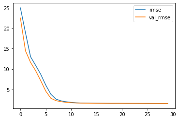
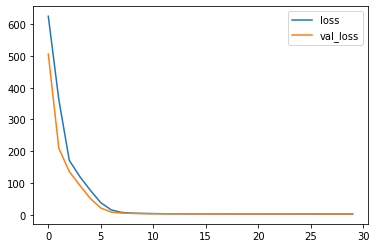

# Introduction

The [Keras sequential API](https://keras.io/models/sequential/) allows you to create Tensorflow models layer-by-layer. This is useful for building most kinds of machine learning models but it does not allow you to create models that share layers, re-use layers or have multiple inputs or outputs. 

## Import Library


```python
import pandas as pd
import tensorflow_data_validation as tfdv
from witwidget.notebook.visualization import WitConfigBuilder
from witwidget.notebook.visualization import WitWidget
from sklearn.model_selection import train_test_split
import tensorflow as tf
from tensorflow.keras import layers
import numpy as np
from tensorflow import feature_column as fc
from tensorflow.keras.callbacks import TensorBoard
from functools import partial
```

## Import file in a DataFrame pandas


```python
df = pd.read_csv('./data/logement-encadrement-des-loyers.csv', sep=';')
df.head(2)
```


<div>
<style scoped>
    .dataframe tbody tr th:only-of-type {
        vertical-align: middle;
    }

    .dataframe tbody tr th {
        vertical-align: top;
    }

    .dataframe thead th {
        text-align: right;
    }
</style>
<table border="1" class="dataframe">
  <thead>
    <tr style="text-align: right;">
      <th></th>
      <th>id_zone</th>
      <th>id_quartier</th>
      <th>nom_quartier</th>
      <th>piece</th>
      <th>epoque</th>
      <th>meuble_txt</th>
      <th>ref</th>
      <th>max</th>
      <th>min</th>
      <th>annee</th>
      <th>ville</th>
      <th>code_grand_quartier</th>
      <th>geo_shape</th>
      <th>geo_point_2d</th>
    </tr>
  </thead>
  <tbody>
    <tr>
      <th>0</th>
      <td>11</td>
      <td>77</td>
      <td>Belleville</td>
      <td>4</td>
      <td>Avant 1946</td>
      <td>non meublé</td>
      <td>21.4</td>
      <td>25.68</td>
      <td>14.98</td>
      <td>2020</td>
      <td>PARIS</td>
      <td>7512077</td>
      <td>{"type": "Polygon", "coordinates": [[[2.383226...</td>
      <td>48.8715312006,2.38754923985</td>
    </tr>
    <tr>
      <th>1</th>
      <td>13</td>
      <td>75</td>
      <td>Amérique</td>
      <td>3</td>
      <td>1971-1990</td>
      <td>non meublé</td>
      <td>16.7</td>
      <td>20.04</td>
      <td>11.69</td>
      <td>2020</td>
      <td>PARIS</td>
      <td>7511975</td>
      <td>{"type": "Polygon", "coordinates": [[[2.409402...</td>
      <td>48.8816381673,2.39544016662</td>
    </tr>
  </tbody>
</table>
</div>


## Processing the dataframe 

Remove the column `geo_shape`and create two columns for the `longitute` and `latitude`.


```python
def df_processing(df):
    
    # Create the columns for the latitude and longitude
    df_lat_lon = df['geo_point_2d'].str.split(',', expand=True)
    df['lat'] = df_lat_lon[0].astype(float) 
    df['lon'] = df_lat_lon[1].astype(float)
    
    # Deleted the column 'geo_shape'
    df = df.drop(['geo_shape','geo_point_2d'], axis=1)
    
    df_processed = df
    
    return df_processed
```


```python
# Show the DataFrame
df_logement = df_processing(df)
df_logement.head(2)
```


<div>
<style scoped>
    .dataframe tbody tr th:only-of-type {
        vertical-align: middle;
    }

    .dataframe tbody tr th {
        vertical-align: top;
    }

    .dataframe thead th {
        text-align: right;
    }
</style>
<table border="1" class="dataframe">
  <thead>
    <tr style="text-align: right;">
      <th></th>
      <th>id_zone</th>
      <th>id_quartier</th>
      <th>nom_quartier</th>
      <th>piece</th>
      <th>epoque</th>
      <th>meuble_txt</th>
      <th>ref</th>
      <th>max</th>
      <th>min</th>
      <th>annee</th>
      <th>ville</th>
      <th>code_grand_quartier</th>
      <th>lat</th>
      <th>lon</th>
    </tr>
  </thead>
  <tbody>
    <tr>
      <th>0</th>
      <td>11</td>
      <td>77</td>
      <td>Belleville</td>
      <td>4</td>
      <td>Avant 1946</td>
      <td>non meublé</td>
      <td>21.4</td>
      <td>25.68</td>
      <td>14.98</td>
      <td>2020</td>
      <td>PARIS</td>
      <td>7512077</td>
      <td>48.871531</td>
      <td>2.387549</td>
    </tr>
    <tr>
      <th>1</th>
      <td>13</td>
      <td>75</td>
      <td>Amérique</td>
      <td>3</td>
      <td>1971-1990</td>
      <td>non meublé</td>
      <td>16.7</td>
      <td>20.04</td>
      <td>11.69</td>
      <td>2020</td>
      <td>PARIS</td>
      <td>7511975</td>
      <td>48.881638</td>
      <td>2.395440</td>
    </tr>
  </tbody>
</table>
</div>


## Explorating Data Analysis (EDA)


```python
df_logement.info()
```

    <class 'pandas.core.frame.DataFrame'>
    RangeIndex: 2560 entries, 0 to 2559
    Data columns (total 14 columns):
     #   Column               Non-Null Count  Dtype  
    ---  ------               --------------  -----  
     0   id_zone              2560 non-null   int64  
     1   id_quartier          2560 non-null   int64  
     2   nom_quartier         2560 non-null   object 
     3   piece                2560 non-null   int64  
     4   epoque               2560 non-null   object 
     5   meuble_txt           2560 non-null   object 
     6   ref                  2560 non-null   float64
     7   max                  2560 non-null   float64
     8   min                  2560 non-null   float64
     9   annee                2560 non-null   int64  
     10  ville                2560 non-null   object 
     11  code_grand_quartier  2560 non-null   int64  
     12  lat                  2560 non-null   float64
     13  lon                  2560 non-null   float64
    dtypes: float64(5), int64(5), object(4)
    memory usage: 280.1+ KB


```python
# .apply for remoce the scientist notation
df_logement.describe().T.apply(lambda s: s.apply('{0:.3f}'.format))
```


<div>
<style scoped>
    .dataframe tbody tr th:only-of-type {
        vertical-align: middle;
    }

    .dataframe tbody tr th {
        vertical-align: top;
    }

    .dataframe thead th {
        text-align: right;
    }
</style>
<table border="1" class="dataframe">
  <thead>
    <tr style="text-align: right;">
      <th></th>
      <th>count</th>
      <th>mean</th>
      <th>std</th>
      <th>min</th>
      <th>25%</th>
      <th>50%</th>
      <th>75%</th>
      <th>max</th>
    </tr>
  </thead>
  <tbody>
    <tr>
      <th>id_zone</th>
      <td>2560.000</td>
      <td>6.662</td>
      <td>4.226</td>
      <td>1.000</td>
      <td>3.000</td>
      <td>5.000</td>
      <td>11.000</td>
      <td>14.000</td>
    </tr>
    <tr>
      <th>id_quartier</th>
      <td>2560.000</td>
      <td>40.500</td>
      <td>23.097</td>
      <td>1.000</td>
      <td>20.750</td>
      <td>40.500</td>
      <td>60.250</td>
      <td>80.000</td>
    </tr>
    <tr>
      <th>piece</th>
      <td>2560.000</td>
      <td>2.500</td>
      <td>1.118</td>
      <td>1.000</td>
      <td>1.750</td>
      <td>2.500</td>
      <td>3.250</td>
      <td>4.000</td>
    </tr>
    <tr>
      <th>ref</th>
      <td>2560.000</td>
      <td>25.727</td>
      <td>4.182</td>
      <td>14.600</td>
      <td>22.900</td>
      <td>25.300</td>
      <td>28.300</td>
      <td>39.600</td>
    </tr>
    <tr>
      <th>max</th>
      <td>2560.000</td>
      <td>30.873</td>
      <td>5.018</td>
      <td>17.520</td>
      <td>27.480</td>
      <td>30.360</td>
      <td>33.960</td>
      <td>47.520</td>
    </tr>
    <tr>
      <th>min</th>
      <td>2560.000</td>
      <td>18.009</td>
      <td>2.927</td>
      <td>10.220</td>
      <td>16.030</td>
      <td>17.710</td>
      <td>19.810</td>
      <td>27.720</td>
    </tr>
    <tr>
      <th>annee</th>
      <td>2560.000</td>
      <td>2020.000</td>
      <td>0.000</td>
      <td>2020.000</td>
      <td>2020.000</td>
      <td>2020.000</td>
      <td>2020.000</td>
      <td>2020.000</td>
    </tr>
    <tr>
      <th>code_grand_quartier</th>
      <td>2560.000</td>
      <td>7511090.500</td>
      <td>599.811</td>
      <td>7510101.000</td>
      <td>7510595.750</td>
      <td>7511090.500</td>
      <td>7511585.250</td>
      <td>7512080.000</td>
    </tr>
    <tr>
      <th>lat</th>
      <td>2560.000</td>
      <td>48.861</td>
      <td>0.018</td>
      <td>48.823</td>
      <td>48.849</td>
      <td>48.862</td>
      <td>48.874</td>
      <td>48.896</td>
    </tr>
    <tr>
      <th>lon</th>
      <td>2560.000</td>
      <td>2.344</td>
      <td>0.035</td>
      <td>2.252</td>
      <td>2.324</td>
      <td>2.345</td>
      <td>2.364</td>
      <td>2.433</td>
    </tr>
  </tbody>
</table>
</div>


```python
stats = tfdv.generate_statistics_from_dataframe(df_logement)
tfdv.visualize_statistics(stats)
```


<iframe id='facets-iframe' width="100%" height="500px"></iframe>
        <script>
        facets_iframe = document.getElementById('facets-iframe');
        facets_html = '<script src="https://cdnjs.cloudflare.com/ajax/libs/webcomponentsjs/1.3.3/webcomponents-lite.js"><\/script><link rel="import" href="https://raw.githubusercontent.com/PAIR-code/facets/master/facets-dist/facets-jupyter.html"><facets-overview proto-input="CtZsCg5saHNfc3RhdGlzdGljcxCAFBrABxqyBwq2AgiAFBgBIAEtAACAPzKkAhobCQAAAAAAAPA/EQAAAAAAAPA/IQAAAAAAAHBAGhsJAAAAAAAA8D8RAAAAAAAA8D8hAAAAAAAAcEAaGwkAAAAAAADwPxEAAAAAAADwPyEAAAAAAABwQBobCQAAAAAAAPA/EQAAAAAAAPA/IQAAAAAAAHBAGhsJAAAAAAAA8D8RAAAAAAAA8D8hAAAAAAAAcEAaGwkAAAAAAADwPxEAAAAAAADwPyEAAAAAAABwQBobCQAAAAAAAPA/EQAAAAAAAPA/IQAAAAAAAHBAGhsJAAAAAAAA8D8RAAAAAAAA8D8hAAAAAAAAcEAaGwkAAAAAAADwPxEAAAAAAADwPyEAAAAAAABwQBobCQAAAAAAAPA/EQAAAAAAAPA/IQAAAAAAAHBAIAFAgBQRZmZmZmamGkAZ7akAYifmEEApAAAAAAAA8D8xAAAAAAAAFEA5AAAAAAAALEBCogIaGwkAAAAAAADwPxFmZmZmZmYCQCGWQ4ts5/uCQBobCWZmZmZmZgJAEc3MzMzMzAxAIX9qvHSTGGBAGhsJzczMzMzMDEARmpmZmZmZE0AhK4cW2c73dUAaGwmamZmZmZkTQBHNzMzMzMwYQCErhxbZzvd1QBobCc3MzMzMzBhAEQAAAAAAAB5AIawcWmQ731dAGhsJAAAAAAAAHkARmpmZmZmZIUAhoBov3SQGQUAaGwmamZmZmZkhQBEzMzMzMzMkQCECK4cW2c5xQBobCTMzMzMzMyRAEc3MzMzMzCZAIVTjpZvEIHJAGhsJzczMzMzMJkARZ2ZmZmZmKUAh/tR46SYxUEAaGwlnZmZmZmYpQBEAAAAAAAAsQCErhxbZzvd1QEKkAhobCQAAAAAAAPA/EQAAAAAAAABAIQAAAAAAAHBAGhsJAAAAAAAAAEARAAAAAAAAAEAhAAAAAAAAcEAaGwkAAAAAAAAAQBEAAAAAAAAQQCEAAAAAAABwQBobCQAAAAAAABBAEQAAAAAAABBAIQAAAAAAAHBAGhsJAAAAAAAAEEARAAAAAAAAFEAhAAAAAAAAcEAaGwkAAAAAAAAUQBEAAAAAAAAgQCEAAAAAAABwQBobCQAAAAAAACBAEQAAAAAAACRAIQAAAAAAAHBAGhsJAAAAAAAAJEARAAAAAAAAJkAhAAAAAAAAcEAaGwkAAAAAAAAmQBEAAAAAAAAqQCEAAAAAAABwQBobCQAAAAAAACpAEQAAAAAAACxAIQAAAAAAAHBAIAFCCQoHaWRfem9uZRrEBxqyBwq2AgiAFBgBIAEtAACAPzKkAhobCQAAAAAAAPA/EQAAAAAAAPA/IQAAAAAAAHBAGhsJAAAAAAAA8D8RAAAAAAAA8D8hAAAAAAAAcEAaGwkAAAAAAADwPxEAAAAAAADwPyEAAAAAAABwQBobCQAAAAAAAPA/EQAAAAAAAPA/IQAAAAAAAHBAGhsJAAAAAAAA8D8RAAAAAAAA8D8hAAAAAAAAcEAaGwkAAAAAAADwPxEAAAAAAADwPyEAAAAAAABwQBobCQAAAAAAAPA/EQAAAAAAAPA/IQAAAAAAAHBAGhsJAAAAAAAA8D8RAAAAAAAA8D8hAAAAAAAAcEAaGwkAAAAAAADwPxEAAAAAAADwPyEAAAAAAABwQBobCQAAAAAAAPA/EQAAAAAAAPA/IQAAAAAAAHBAIAFAgBQRAAAAAABAREAZlmP915oXN0ApAAAAAAAA8D8xAAAAAACAREA5AAAAAAAAVEBCogIaGwkAAAAAAADwPxHNzMzMzMwhQCErhxbZzvdvQBobCc3MzMzMzCFAEc3MzMzMzDBAISuHFtnO929AGhsJzczMzMzMMEARNDMzMzOzOEAhK4cW2c73b0AaGwk0MzMzM7M4QBHNzMzMzExAQCErhxbZzvdvQBobCc3MzMzMTEBAEQAAAAAAQERAISuHFtnO929AGhsJAAAAAABAREARNDMzMzMzSEAhK4cW2c73b0AaGwk0MzMzMzNIQBFnZmZmZiZMQCEqhxbZzvdvQBobCWdmZmZmJkxAEc3MzMzMDFBAISuHFtnO929AGhsJzczMzMwMUEARZ2ZmZmYGUkAhLIcW2c73b0AaGwlnZmZmZgZSQBEAAAAAAABUQCG+nxov3SRwQEKkAhobCQAAAAAAAPA/EQAAAAAAACJAIQAAAAAAAHBAGhsJAAAAAAAAIkARAAAAAAAAMUAhAAAAAAAAcEAaGwkAAAAAAAAxQBEAAAAAAAA5QCEAAAAAAABwQBobCQAAAAAAADlAEQAAAAAAgEBAIQAAAAAAAHBAGhsJAAAAAACAQEARAAAAAACAREAhAAAAAAAAcEAaGwkAAAAAAIBEQBEAAAAAAIBIQCEAAAAAAABwQBobCQAAAAAAgEhAEQAAAAAAgExAIQAAAAAAAHBAGhsJAAAAAACATEARAAAAAABAUEAhAAAAAAAAcEAaGwkAAAAAAEBQQBEAAAAAAEBSQCEAAAAAAABwQBobCQAAAAAAQFJAEQAAAAAAAFRAIQAAAAAAAHBAIAFCDQoLaWRfcXVhcnRpZXIa8BgQAiLbGAq2AgiAFBgBIAEtAACAPzKkAhobCQAAAAAAAPA/EQAAAAAAAPA/IQAAAAAAAHBAGhsJAAAAAAAA8D8RAAAAAAAA8D8hAAAAAAAAcEAaGwkAAAAAAADwPxEAAAAAAADwPyEAAAAAAABwQBobCQAAAAAAAPA/EQAAAAAAAPA/IQAAAAAAAHBAGhsJAAAAAAAA8D8RAAAAAAAA8D8hAAAAAAAAcEAaGwkAAAAAAADwPxEAAAAAAADwPyEAAAAAAABwQBobCQAAAAAAAPA/EQAAAAAAAPA/IQAAAAAAAHBAGhsJAAAAAAAA8D8RAAAAAAAA8D8hAAAAAAAAcEAaGwkAAAAAAADwPxEAAAAAAADwPyEAAAAAAABwQBobCQAAAAAAAPA/EQAAAAAAAPA/IQAAAAAAAHBAIAFAgBQQUBoTEghWaXZpZW5uZRkAAAAAAABAQBoTEghWaWxsZXR0ZRkAAAAAAABAQBoXEgxWYWwtZGUtR3JhY2UZAAAAAAAAQEAaERIGVGVybmVzGQAAAAAAAEBAGiESFlN0LUdlcm1haW4tbCdBdXhlcnJvaXMZAAAAAAAAQEAaExIIU29yYm9ubmUZAAAAAAAAQEAaGBINU2FscMOqdHJpw6hyZRkAAAAAAABAQBocEhFTYWludGUtTWFyZ3Vlcml0ZRkAAAAAAABAQBoXEgxTYWludGUtQXZvaWUZAAAAAAAAQEAaIBIVU2FpbnQtVmluY2VudC1kZS1QYXVsGQAAAAAAAEBAGhcSDFNhaW50LVZpY3RvchkAAAAAAABAQBofEhRTYWludC1UaG9tYXMtZCdBcXVpbhkAAAAAAABAQBoWEgtTYWludC1NZXJyaRkAAAAAAABAQBoYEg1TYWludC1MYW1iZXJ0GQAAAAAAAEBAGhgSDVNhaW50LUdlcnZhaXMZAAAAAAAAQEAaIhIXU2FpbnQtR2VybWFpbi1kZXMtUHLDqXMZAAAAAAAAQEAaGBINU2FpbnQtR2VvcmdlcxkAAAAAAABAQBoYEg1TYWludC1GYXJnZWF1GQAAAAAAAEBAGhkSDlNhaW50LUFtYnJvaXNlGQAAAAAAAEBAGhMSCFJvcXVldHRlGQAAAAAAAEBAJWZmP0EqiRIKEyIIVml2aWVubmUpAAAAAAAAQEAKFwgBEAEiCFZpbGxldHRlKQAAAAAAAEBAChsIAhACIgxWYWwtZGUtR3JhY2UpAAAAAAAAQEAKFQgDEAMiBlRlcm5lcykAAAAAAABAQAolCAQQBCIWU3QtR2VybWFpbi1sJ0F1eGVycm9pcykAAAAAAABAQAoXCAUQBSIIU29yYm9ubmUpAAAAAAAAQEAKHAgGEAYiDVNhbHDDqnRyacOocmUpAAAAAAAAQEAKIAgHEAciEVNhaW50ZS1NYXJndWVyaXRlKQAAAAAAAEBAChsICBAIIgxTYWludGUtQXZvaWUpAAAAAAAAQEAKJAgJEAkiFVNhaW50LVZpbmNlbnQtZGUtUGF1bCkAAAAAAABAQAobCAoQCiIMU2FpbnQtVmljdG9yKQAAAAAAAEBACiMICxALIhRTYWludC1UaG9tYXMtZCdBcXVpbikAAAAAAABAQAoaCAwQDCILU2FpbnQtTWVycmkpAAAAAAAAQEAKHAgNEA0iDVNhaW50LUxhbWJlcnQpAAAAAAAAQEAKHAgOEA4iDVNhaW50LUdlcnZhaXMpAAAAAAAAQEAKJggPEA8iF1NhaW50LUdlcm1haW4tZGVzLVByw6lzKQAAAAAAAEBAChwIEBAQIg1TYWludC1HZW9yZ2VzKQAAAAAAAEBAChwIERARIg1TYWludC1GYXJnZWF1KQAAAAAAAEBACh0IEhASIg5TYWludC1BbWJyb2lzZSkAAAAAAABAQAoXCBMQEyIIUm9xdWV0dGUpAAAAAAAAQEAKGwgUEBQiDFJvY2hlY2hvdWFydCkAAAAAAABAQAocCBUQFSINUXVpbnplLVZpbmd0cykAAAAAAABAQAodCBYQFiIOUMOocmUtTGFjaGFpc2UpAAAAAAAAQEAKIQgXEBciElBvcnRlLVNhaW50LU1hcnRpbikAAAAAAABAQAogCBgQGCIRUG9ydGUtU2FpbnQtRGVuaXMpAAAAAAAAQEAKHQgZEBkiDlBvcnRlLURhdXBoaW5lKQAAAAAAAEBACh4IGhAaIg9Qb250LWRlLUZsYW5kcmUpAAAAAAAAQEAKGAgbEBsiCVBsYWlzYW5jZSkAAAAAAABAQAohCBwQHCISUGxhaW5lIGRlIE1vbmNlYXV4KQAAAAAAAEBACh0IHRAdIg5QbGFjZS1WZW5kw7RtZSkAAAAAAABAQAoVCB4QHiIGUGljcHVzKQAAAAAAAEBACh4IHxAfIg9QZXRpdC1Nb250cm91Z2UpAAAAAAAAQEAKIQggECAiElBhcmMtZGUtTW9udHNvdXJpcykAAAAAAABAQAobCCEQISIMUGFsYWlzLVJveWFsKQAAAAAAAEBAChQIIhAiIgVPZGVvbikAAAAAAABAQAokCCMQIyIVTm90cmUtRGFtZS1kZXMtQ2hhbXBzKQAAAAAAAEBAChkIJBAkIgpOb3RyZS1EYW1lKQAAAAAAAEBAChUIJRAlIgZOZWNrZXIpAAAAAAAAQEAKFQgmECYiBk11ZXR0ZSkAAAAAAABAQAobCCcQJyIMTW9udHBhcm5hc3NlKQAAAAAAAEBAChYIKBAoIgdNb25uYWllKQAAAAAAAEBACh0IKRApIg5NYWlzb24tQmxhbmNoZSkAAAAAAABAQAoTCCoQKiIETWFpbCkAAAAAAABAQAoYCCsQKyIJTWFkZWxlaW5lKQAAAAAAAEBAChoILBAsIgtMYSBDaGFwZWxsZSkAAAAAAABAQAoaCC0QLSILSmF2ZWwgMTVBcnQpAAAAAAAAQEAKIQguEC4iEkphcmRpbi1kZXMtUGxhbnRlcykAAAAAAABAQAoYCC8QLyIJSW52YWxpZGVzKQAAAAAAAEBACiMIMBAwIhRIw7RwaXRhbC1TYWludC1Mb3VpcykAAAAAAABAQAoVCDEQMSIGSGFsbGVzKQAAAAAAAEBAChsIMhAyIgxHcm9zLUNhaWxsb3UpAAAAAAAAQEAKFwgzEDMiCEdyZW5lbGxlKQAAAAAAAEBACiEINBA0IhJHcmFuZGVzLUNhcnJpw6hyZXMpAAAAAAAAQEAKGgg1EDUiC0dvdXR0ZS1kJ09yKQAAAAAAAEBAChMINhA2IgRHYXJlKQAAAAAAAEBAChYINxA3IgdHYWlsbG9uKQAAAAAAAEBACh8IOBA4IhBGb2xpZS1Nw6lyaWNvdXJ0KQAAAAAAAEBACiAIORA5IhFGYXVib3VyZy1kdS1Sb3VsZSkAAAAAAABAQAoiCDoQOiITRmF1Ym91cmctTW9udG1hcnRyZSkAAAAAAABAQAoVCDsQOyIGRXVyb3BlKQAAAAAAAEBAChgIPBA8IglFcGluZXR0ZXMpAAAAAAAAQEAKHQg9ED0iDkVuZmFudHMtUm91Z2VzKQAAAAAAAEBACh4IPhA+Ig9FY29sZS1NaWxpdGFpcmUpAAAAAAAAQEAKGgg/ED8iC0Nyb3VsZWJhcmJlKQAAAAAAAEBAChUIQBBAIgZDb21iYXQpAAAAAAAAQEAKGwhBEEEiDENsaWduYW5jb3VydCkAAAAAAABAQAogCEIQQiIRQ2hhdXNzw6llLWQnQW50aW4pAAAAAAAAQEAKFwhDEEMiCENoYXJvbm5lKQAAAAAAAEBACh4IRBBEIg9DaGFtcHMtRWx5c8OpZXMpAAAAAAAAQEAKFwhFEEUiCENoYWlsbG90KQAAAAAAAEBACh0IRhBGIg5Cb25uZS1Ob3V2ZWxsZSkAAAAAAABAQAoUCEcQRyIFQmVyY3kpAAAAAAAAQEAKGQhIEEgiCkJlbGxldmlsbGUpAAAAAAAAQEAKFghJEEkiB0JlbC1BaXIpAAAAAAAAQEAKGghKEEoiC0JhdGlnbm9sbGVzKQAAAAAAAEBAChYISxBLIgdBdXRldWlsKQAAAAAAAEBACh4ITBBMIg9BcnRzLWV0LU1ldGllcnMpAAAAAAAAQEAKFghNEE0iB0Fyc2VuYWwpAAAAAAAAQEAKFwhOEE4iCEFyY2hpdmVzKQAAAAAAAEBAChgITxBPIglBbcOpcmlxdWUpAAAAAAAAQEBCDgoMbm9tX3F1YXJ0aWVyGr4HGrIHCrYCCIAUGAEgAS0AAIA/MqQCGhsJAAAAAAAA8D8RAAAAAAAA8D8hAAAAAAAAcEAaGwkAAAAAAADwPxEAAAAAAADwPyEAAAAAAABwQBobCQAAAAAAAPA/EQAAAAAAAPA/IQAAAAAAAHBAGhsJAAAAAAAA8D8RAAAAAAAA8D8hAAAAAAAAcEAaGwkAAAAAAADwPxEAAAAAAADwPyEAAAAAAABwQBobCQAAAAAAAPA/EQAAAAAAAPA/IQAAAAAAAHBAGhsJAAAAAAAA8D8RAAAAAAAA8D8hAAAAAAAAcEAaGwkAAAAAAADwPxEAAAAAAADwPyEAAAAAAABwQBobCQAAAAAAAPA/EQAAAAAAAPA/IQAAAAAAAHBAGhsJAAAAAAAA8D8RAAAAAAAA8D8hAAAAAAAAcEAgAUCAFBEAAAAAAAAEQBmo9Jebd+PxPykAAAAAAADwPzEAAAAAAAAIQDkAAAAAAAAQQEKiAhobCQAAAAAAAPA/Ec3MzMzMzPQ/IYxs5/up8YNAGhsJzczMzMzM9D8RmpmZmZmZ+T8h+35qvHST6D8aGwmamZmZmZn5PxFmZmZmZmb+PyH2fmq8dJPoPxobCWZmZmZmZv4/EZqZmZmZmQFAIYxs5/up8YNAGhsJmpmZmZmZAUARAAAAAAAABEAh9n5qvHST6D8aGwkAAAAAAAAEQBFmZmZmZmYGQCH2fmq8dJPoPxobCWZmZmZmZgZAEc3MzMzMzAhAIYts5/up8YNAGhsJzczMzMzMCEARMzMzMzMzC0Ah9n5qvHST6D8aGwkzMzMzMzMLQBGZmZmZmZkNQCH2fmq8dJPoPxobCZmZmZmZmQ1AEQAAAAAAABBAIaEaL90kBoRAQqQCGhsJAAAAAAAA8D8RAAAAAAAA8D8hAAAAAAAAcEAaGwkAAAAAAADwPxEAAAAAAADwPyEAAAAAAABwQBobCQAAAAAAAPA/EQAAAAAAAABAIQAAAAAAAHBAGhsJAAAAAAAAAEARAAAAAAAAAEAhAAAAAAAAcEAaGwkAAAAAAAAAQBEAAAAAAAAIQCEAAAAAAABwQBobCQAAAAAAAAhAEQAAAAAAAAhAIQAAAAAAAHBAGhsJAAAAAAAACEARAAAAAAAACEAhAAAAAAAAcEAaGwkAAAAAAAAIQBEAAAAAAAAQQCEAAAAAAABwQBobCQAAAAAAABBAEQAAAAAAABBAIQAAAAAAAHBAGhsJAAAAAAAAEEARAAAAAAAAEEAhAAAAAAAAcEAgAUIHCgVwaWVjZRqRBBACIoIECrYCCIAUGAEgAS0AAIA/MqQCGhsJAAAAAAAA8D8RAAAAAAAA8D8hAAAAAAAAcEAaGwkAAAAAAADwPxEAAAAAAADwPyEAAAAAAABwQBobCQAAAAAAAPA/EQAAAAAAAPA/IQAAAAAAAHBAGhsJAAAAAAAA8D8RAAAAAAAA8D8hAAAAAAAAcEAaGwkAAAAAAADwPxEAAAAAAADwPyEAAAAAAABwQBobCQAAAAAAAPA/EQAAAAAAAPA/IQAAAAAAAHBAGhsJAAAAAAAA8D8RAAAAAAAA8D8hAAAAAAAAcEAaGwkAAAAAAADwPxEAAAAAAADwPyEAAAAAAABwQBobCQAAAAAAAPA/EQAAAAAAAPA/IQAAAAAAAHBAGhsJAAAAAAAA8D8RAAAAAAAA8D8hAAAAAAAAcEAgAUCAFBAEGhUSCkF2YW50IDE5NDYZAAAAAAAAhEAaFRIKQXByZXMgMTk5MBkAAAAAAACEQBoUEgkxOTcxLTE5OTAZAAAAAAAAhEAaFBIJMTk0Ni0xOTcwGQAAAAAAAIRAJQAAGEEqZgoVIgpBdmFudCAxOTQ2KQAAAAAAAIRAChkIARABIgpBcHJlcyAxOTkwKQAAAAAAAIRAChgIAhACIgkxOTcxLTE5OTApAAAAAAAAhEAKGAgDEAMiCTE5NDYtMTk3MCkAAAAAAACEQEIICgZlcG9xdWUasQMQAiKeAwq2AgiAFBgBIAEtAACAPzKkAhobCQAAAAAAAPA/EQAAAAAAAPA/IQAAAAAAAHBAGhsJAAAAAAAA8D8RAAAAAAAA8D8hAAAAAAAAcEAaGwkAAAAAAADwPxEAAAAAAADwPyEAAAAAAABwQBobCQAAAAAAAPA/EQAAAAAAAPA/IQAAAAAAAHBAGhsJAAAAAAAA8D8RAAAAAAAA8D8hAAAAAAAAcEAaGwkAAAAAAADwPxEAAAAAAADwPyEAAAAAAABwQBobCQAAAAAAAPA/EQAAAAAAAPA/IQAAAAAAAHBAGhsJAAAAAAAA8D8RAAAAAAAA8D8hAAAAAAAAcEAaGwkAAAAAAADwPxEAAAAAAADwPyEAAAAAAABwQBobCQAAAAAAAPA/EQAAAAAAAPA/IQAAAAAAAHBAIAFAgBQQAhoWEgtub24gbWV1YmzDqRkAAAAAAACUQBoSEgdtZXVibMOpGQAAAAAAAJRAJQAAEEEqMAoWIgtub24gbWV1YmzDqSkAAAAAAACUQAoWCAEQASIHbWV1YmzDqSkAAAAAAACUQEIMCgptZXVibGVfdHh0Gr4HEAEasgcKtgIIgBQYASABLQAAgD8ypAIaGwkAAAAAAADwPxEAAAAAAADwPyEAAAAAAABwQBobCQAAAAAAAPA/EQAAAAAAAPA/IQAAAAAAAHBAGhsJAAAAAAAA8D8RAAAAAAAA8D8hAAAAAAAAcEAaGwkAAAAAAADwPxEAAAAAAADwPyEAAAAAAABwQBobCQAAAAAAAPA/EQAAAAAAAPA/IQAAAAAAAHBAGhsJAAAAAAAA8D8RAAAAAAAA8D8hAAAAAAAAcEAaGwkAAAAAAADwPxEAAAAAAADwPyEAAAAAAABwQBobCQAAAAAAAPA/EQAAAAAAAPA/IQAAAAAAAHBAGhsJAAAAAAAA8D8RAAAAAAAA8D8hAAAAAAAAcEAaGwkAAAAAAADwPxEAAAAAAADwPyEAAAAAAABwQCABQIAUEVK4HoUrujlAGeBoLyN7uRBAKTMzMzMzMy1AMc3MzMzMTDlAOc3MzMzMzENAQqICGhsJMzMzMzMzLUARmpmZmZkZMUAhQ2Dl0CLbSUAaGwmamZmZmRkxQBGamZmZmZkzQCG28/3UeOlWQBobCZqZmZmZmTNAEZqZmZmZGTZAIdejcD0K13NAGhsJmpmZmZkZNkARmpmZmZmZOEAh9Shcj8L1gkAaGwmamZmZmZk4QBGamZmZmRk7QCHhehSuR+GCQBobCZqZmZmZGTtAEZqZmZmZmT1AIbkehetRuHpAGhsJmpmZmZmZPUARzczMzMwMQEAhw/UoXI/CcUAaGwnNzMzMzAxAQBHNzMzMzExBQCGkcD0K16NYQBobCc3MzMzMTEFAEc3MzMzMjEJAIQjxdtW9Q1JAGhsJzczMzMyMQkARzczMzMzMQ0AhxqevLQ4WFEBCpAIaGwkzMzMzMzMtQBEzMzMzM7M0QCEAAAAAAABwQBobCTMzMzMzszRAEc3MzMzMTDZAIQAAAAAAAHBAGhsJzczMzMxMNkARZmZmZmZmN0AhAAAAAAAAcEAaGwlmZmZmZmY3QBEAAAAAAIA4QCEAAAAAAABwQBobCQAAAAAAgDhAEc3MzMzMTDlAIQAAAAAAAHBAGhsJzczMzMxMOUARAAAAAACAOkAhAAAAAAAAcEAaGwkAAAAAAIA6QBEzMzMzM7M7QCEAAAAAAABwQBobCTMzMzMzsztAEWZmZmZm5jxAIQAAAAAAAHBAGhsJZmZmZmbmPEARAAAAAACAP0AhAAAAAAAAcEAaGwkAAAAAAIA/QBHNzMzMzMxDQCEAAAAAAABwQCABQgUKA3JlZhq+BxABGrIHCrYCCIAUGAEgAS0AAIA/MqQCGhsJAAAAAAAA8D8RAAAAAAAA8D8hAAAAAAAAcEAaGwkAAAAAAADwPxEAAAAAAADwPyEAAAAAAABwQBobCQAAAAAAAPA/EQAAAAAAAPA/IQAAAAAAAHBAGhsJAAAAAAAA8D8RAAAAAAAA8D8hAAAAAAAAcEAaGwkAAAAAAADwPxEAAAAAAADwPyEAAAAAAABwQBobCQAAAAAAAPA/EQAAAAAAAPA/IQAAAAAAAHBAGhsJAAAAAAAA8D8RAAAAAAAA8D8hAAAAAAAAcEAaGwkAAAAAAADwPxEAAAAAAADwPyEAAAAAAABwQBobCQAAAAAAAPA/EQAAAAAAAPA/IQAAAAAAAHBAGhsJAAAAAAAA8D8RAAAAAAAA8D8hAAAAAAAAcEAgAUCAFBGWQ4tsZ98+QBn8sAX3xhEUQCmF61G4HoUxQDFcj8L1KFw+QDnD9Shcj8JHQEKiAhobCYXrUbgehTFAEYXrUbgehTRAIUJg5dAi20lAGhsJhetRuB6FNEARhetRuB6FN0Aht/P91HjpVkAaGwmF61G4HoU3QBGG61G4HoU6QCH3KFyPwvV0QBobCYbrUbgehTpAEYbrUbgehT1AIfcoXI/C9YJAGhsJhutRuB6FPUARw/UoXI9CQEAhUrgehetRgkAaGwnD9Shcj0JAQBHD9Shcj8JBQCG5HoXrUbh6QBobCcP1KFyPwkFAEcP1KFyPQkNAIcP1KFyPwnFAGhsJw/UoXI9CQ0ARw/UoXI/CREAhpXA9CtejWEAaGwnD9Shcj8JEQBHD9Shcj0JGQCEH8XbVvUNSQBobCcP1KFyPQkZAEcP1KFyPwkdAIcOnry0OFhRAQqQCGhsJhetRuB6FMUAR16NwPQrXOEAhAAAAAAAAcEAaGwnXo3A9Ctc4QBHD9Shcj8I6QCEAAAAAAABwQBobCcP1KFyPwjpAERSuR+F6FDxAIQAAAAAAAHBAGhsJFK5H4XoUPEARZmZmZmZmPUAhAAAAAAAAcEAaGwlmZmZmZmY9QBFcj8L1KFw+QCEAAAAAAABwQBobCVyPwvUoXD5AEc3MzMzMzD9AIQAAAAAAAHBAGhsJzczMzMzMP0ARH4XrUbieQEAhAAAAAAAAcEAaGwkfhetRuJ5AQBHXo3A9CldBQCEAAAAAAABwQBobCdejcD0KV0FAEWZmZmZm5kJAIQAAAAAAAHBAGhsJZmZmZmbmQkARw/UoXI/CR0AhAAAAAAAAcEAgAUIFCgNtYXgavgcQARqyBwq2AgiAFBgBIAEtAACAPzKkAhobCQAAAAAAAPA/EQAAAAAAAPA/IQAAAAAAAHBAGhsJAAAAAAAA8D8RAAAAAAAA8D8hAAAAAAAAcEAaGwkAAAAAAADwPxEAAAAAAADwPyEAAAAAAABwQBobCQAAAAAAAPA/EQAAAAAAAPA/IQAAAAAAAHBAGhsJAAAAAAAA8D8RAAAAAAAA8D8hAAAAAAAAcEAaGwkAAAAAAADwPxEAAAAAAADwPyEAAAAAAABwQBobCQAAAAAAAPA/EQAAAAAAAPA/IQAAAAAAAHBAGhsJAAAAAAAA8D8RAAAAAAAA8D8hAAAAAAAAcEAaGwkAAAAAAADwPxEAAAAAAADwPyEAAAAAAABwQBobCQAAAAAAAPA/EQAAAAAAAPA/IQAAAAAAAHBAIAFAgBQRbef7qVECMkAZFvnbyhJqB0ApcT0K16NwJEAx9ihcj8K1MUA5uB6F61G4O0BCogIaGwlxPQrXo3AkQBFxPQrXo/AnQCFCYOXQIttJQBobCXE9Ctej8CdAEXE9CtejcCtAIbfz/dR46VZAGhsJcT0K16NwK0ARcT0K16PwLkAh16NwPQrXc0AaGwlxPQrXo/AuQBG4HoXrUTgxQCH1KFyPwvWCQBobCbgehetRODFAEbgehetR+DJAIeF6FK5H4YJAGhsJuB6F61H4MkARuB6F61G4NEAhuR6F61G4ekAaGwm4HoXrUbg0QBG4HoXrUXg2QCHD9Shcj8JxQBobCbgehetReDZAEbgehetRODhAIaNwPQrXo1hAGhsJuB6F61E4OEARuB6F61H4OUAhCPF21b1DUkAaGwm4HoXrUfg5QBG4HoXrUbg7QCHHp68tDhYUQEKkAhobCXE9CtejcCRAEXsUrkfh+ixAIQAAAAAAAHBAGhsJexSuR+H6LEARuB6F61E4L0AhAAAAAAAAcEAaGwm4HoXrUTgvQBHhehSuR2EwQCEAAAAAAABwQBobCeF6FK5HYTBAEWZmZmZmJjFAIQAAAAAAAHBAGhsJZmZmZmYmMUAR9ihcj8K1MUAhAAAAAAAAcEAaGwn2KFyPwrUxQBHNzMzMzIwyQCEAAAAAAABwQBobCc3MzMzMjDJAEaRwPQrXYzNAIQAAAAAAAHBAGhsJpHA9CtdjM0ARexSuR+E6NEAhAAAAAAAAcEAaGwl7FK5H4To0QBHNzMzMzAw2QCEAAAAAAABwQBobCc3MzMzMDDZAEbgehetRuDtAIQAAAAAAAHBAIAFCBQoDbWluGq8FGqMFCrYCCIAUGAEgAS0AAIA/MqQCGhsJAAAAAAAA8D8RAAAAAAAA8D8hAAAAAAAAcEAaGwkAAAAAAADwPxEAAAAAAADwPyEAAAAAAABwQBobCQAAAAAAAPA/EQAAAAAAAPA/IQAAAAAAAHBAGhsJAAAAAAAA8D8RAAAAAAAA8D8hAAAAAAAAcEAaGwkAAAAAAADwPxEAAAAAAADwPyEAAAAAAABwQBobCQAAAAAAAPA/EQAAAAAAAPA/IQAAAAAAAHBAGhsJAAAAAAAA8D8RAAAAAAAA8D8hAAAAAAAAcEAaGwkAAAAAAADwPxEAAAAAAADwPyEAAAAAAABwQBobCQAAAAAAAPA/EQAAAAAAAPA/IQAAAAAAAHBAGhsJAAAAAAAA8D8RAAAAAAAA8D8hAAAAAAAAcEAgAUCAFBEAAAAAAJCfQCkAAAAAAJCfQDEAAAAAAJCfQDkAAAAAAJCfQEIdGhsJAAAAAACQn0ARAAAAAACQn0AhAAAAAAAApEBCpAIaGwkAAAAAAJCfQBEAAAAAAJCfQCEAAAAAAABwQBobCQAAAAAAkJ9AEQAAAAAAkJ9AIQAAAAAAAHBAGhsJAAAAAACQn0ARAAAAAACQn0AhAAAAAAAAcEAaGwkAAAAAAJCfQBEAAAAAAJCfQCEAAAAAAABwQBobCQAAAAAAkJ9AEQAAAAAAkJ9AIQAAAAAAAHBAGhsJAAAAAACQn0ARAAAAAACQn0AhAAAAAAAAcEAaGwkAAAAAAJCfQBEAAAAAAJCfQCEAAAAAAABwQBobCQAAAAAAkJ9AEQAAAAAAkJ9AIQAAAAAAAHBAGhsJAAAAAACQn0ARAAAAAACQn0AhAAAAAAAAcEAaGwkAAAAAAJCfQBEAAAAAAJCfQCEAAAAAAABwQCABQgcKBWFubmVlGvQCEAIi5gIKtgIIgBQYASABLQAAgD8ypAIaGwkAAAAAAADwPxEAAAAAAADwPyEAAAAAAABwQBobCQAAAAAAAPA/EQAAAAAAAPA/IQAAAAAAAHBAGhsJAAAAAAAA8D8RAAAAAAAA8D8hAAAAAAAAcEAaGwkAAAAAAADwPxEAAAAAAADwPyEAAAAAAABwQBobCQAAAAAAAPA/EQAAAAAAAPA/IQAAAAAAAHBAGhsJAAAAAAAA8D8RAAAAAAAA8D8hAAAAAAAAcEAaGwkAAAAAAADwPxEAAAAAAADwPyEAAAAAAABwQBobCQAAAAAAAPA/EQAAAAAAAPA/IQAAAAAAAHBAGhsJAAAAAAAA8D8RAAAAAAAA8D8hAAAAAAAAcEAaGwkAAAAAAADwPxEAAAAAAADwPyEAAAAAAABwQCABQIAUEAEaEBIFUEFSSVMZAAAAAAAApEAlAACgQCoSChAiBVBBUklTKQAAAAAAAKRAQgcKBXZpbGxlGswHGrIHCrYCCIAUGAEgAS0AAIA/MqQCGhsJAAAAAAAA8D8RAAAAAAAA8D8hAAAAAAAAcEAaGwkAAAAAAADwPxEAAAAAAADwPyEAAAAAAABwQBobCQAAAAAAAPA/EQAAAAAAAPA/IQAAAAAAAHBAGhsJAAAAAAAA8D8RAAAAAAAA8D8hAAAAAAAAcEAaGwkAAAAAAADwPxEAAAAAAADwPyEAAAAAAABwQBobCQAAAAAAAPA/EQAAAAAAAPA/IQAAAAAAAHBAGhsJAAAAAAAA8D8RAAAAAAAA8D8hAAAAAAAAcEAaGwkAAAAAAADwPxEAAAAAAADwPyEAAAAAAABwQBobCQAAAAAAAPA/EQAAAAAAAPA/IQAAAAAAAHBAGhsJAAAAAAAA8D8RAAAAAAAA8D8hAAAAAAAAcEAgAUCAFBEAAACgDKdcQRn3Mqbrjb2CQCkAAABAFaZcQTEAAABAGadcQTkAAAAABKhcQUKiAhobCQAAAEAVplxBEZqZmblGplxBIXeIFtnO929AGhsJmpmZuUamXEERMzMzM3imXEEhOYUW2c73b0AaGwkzMzMzeKZcQRHNzMysqaZcQSF3iBbZzvdvQBobCc3MzKypplxBEWZmZibbplxBITmFFtnO929AGhsJZmZmJtumXEERAAAAoAynXEEhd4gW2c73b0AaGwkAAACgDKdcQRGamZkZPqdcQSF3iBbZzvdvQBobCZqZmRk+p1xBETMzM5Nvp1xBITmFFtnO929AGhsJMzMzk2+nXEERzczMDKGnXEEhd4gW2c73b0AaGwnNzMwMoadcQRFmZmaG0qdcQSE5hRbZzvdvQBobCWZmZobSp1xBEQAAAAAEqFxBIWWgGi/dJHBAQqQCGhsJAAAAQBWmXEERAAAAQEmmXEEhAAAAAAAAcEAaGwkAAABASaZcQREAAABAfaZcQSEAAAAAAABwQBobCQAAAEB9plxBEQAAAECxplxBIQAAAAAAAHBAGhsJAAAAQLGmXEERAAAAQOWmXEEhAAAAAAAAcEAaGwkAAABA5aZcQREAAABAGadcQSEAAAAAAABwQBobCQAAAEAZp1xBEQAAAEBNp1xBIQAAAAAAAHBAGhsJAAAAQE2nXEERAAAAQIGnXEEhAAAAAAAAcEAaGwkAAABAgadcQREAAABAtadcQSEAAAAAAABwQBobCQAAAEC1p1xBEQAAAEDpp1xBIQAAAAAAAHBAGhsJAAAAQOmnXEERAAAAAASoXEEhAAAAAAAAcEAgAUIVChNjb2RlX2dyYW5kX3F1YXJ0aWVyGr4HEAEasgcKtgIIgBQYASABLQAAgD8ypAIaGwkAAAAAAADwPxEAAAAAAADwPyEAAAAAAABwQBobCQAAAAAAAPA/EQAAAAAAAPA/IQAAAAAAAHBAGhsJAAAAAAAA8D8RAAAAAAAA8D8hAAAAAAAAcEAaGwkAAAAAAADwPxEAAAAAAADwPyEAAAAAAABwQBobCQAAAAAAAPA/EQAAAAAAAPA/IQAAAAAAAHBAGhsJAAAAAAAA8D8RAAAAAAAA8D8hAAAAAAAAcEAaGwkAAAAAAADwPxEAAAAAAADwPyEAAAAAAABwQBobCQAAAAAAAPA/EQAAAAAAAPA/IQAAAAAAAHBAGhsJAAAAAAAA8D8RAAAAAAAA8D8hAAAAAAAAcEAaGwkAAAAAAADwPxEAAAAAAADwPyEAAAAAAABwQCABQIAUETi1VfQ0bkhAGVqfyh3RwJI/KXL0fkBcaUhAMfcZm0ZobkhAOVLTVZKhckhAQqICGhsJcvR+QFxpSEARiNd6lUlqSEAho2LkFFuuZ0AaGwmI13qVSWpIQBGfunbqNmtIQCHCKUC6/E1gQBobCZ+6duo2a0hAEbWdcj8kbEhAIVGwbrYE4WdAGhsJtZ1yPyRsSEARzIBulBFtSEAhIRrFmnzoc0AaGwnMgG6UEW1IQBHiY2rp/m1IQCHq6X3DjBh2QBobCeJjaun+bUhAEfhGZj7sbkhAITm8inLc73FAGhsJ+EZmPuxuSEARDypik9lvSEAheK5pmwknfkAaGwkPKmKT2W9IQBElDV7oxnBIQCGKSVnT6wNwQBobCSUNXujGcEhAETzwWT20cUhAIT0FZ6gOA2BAGhsJPPBZPbRxSEARUtNVkqFySEAhg03kUt7na0BCpAIaGwly9H5AXGlIQBFmUlEh6GpIQCEAAAAAAABwQBobCWZSUSHoakhAEbtUSb1XbEhAIQAAAAAAAHBAGhsJu1RJvVdsSEARFDE2vgBtSEAhAAAAAAAAcEAaGwkUMTa+AG1IQBEk6ERGtG1IQCEAAAAAAABwQBobCSToREa0bUhAEfcZm0ZobkhAIQAAAAAAAHBAGhsJ9xmbRmhuSEARGGlrxv5uSEAhAAAAAAAAcEAaGwkYaWvG/m5IQBG/SK+ghW9IQCEAAAAAAABwQBobCb9Ir6CFb0hAEUOGniRncEhAIQAAAAAAAHBAGhsJQ4aeJGdwSEAR9Cnp4J5xSEAhAAAAAAAAcEAaGwn0KengnnFIQBFS01WSoXJIQCEAAAAAAABwQCABQgUKA2xhdBq+BxABGrIHCrYCCIAUGAEgAS0AAIA/MqQCGhsJAAAAAAAA8D8RAAAAAAAA8D8hAAAAAAAAcEAaGwkAAAAAAADwPxEAAAAAAADwPyEAAAAAAABwQBobCQAAAAAAAPA/EQAAAAAAAPA/IQAAAAAAAHBAGhsJAAAAAAAA8D8RAAAAAAAA8D8hAAAAAAAAcEAaGwkAAAAAAADwPxEAAAAAAADwPyEAAAAAAABwQBobCQAAAAAAAPA/EQAAAAAAAPA/IQAAAAAAAHBAGhsJAAAAAAAA8D8RAAAAAAAA8D8hAAAAAAAAcEAaGwkAAAAAAADwPxEAAAAAAADwPyEAAAAAAABwQBobCQAAAAAAAPA/EQAAAAAAAPA/IQAAAAAAAHBAGhsJAAAAAAAA8D8RAAAAAAAA8D8hAAAAAAAAcEAgAUCAFBG4aWDDVsACQBnpr+Tt/eOhPynPXFvBqQQCQDEZ9CZVWsICQDlKZ0xCJncDQEKiAhobCc9cW8GpBAJAEaiqpjS2KQJAIajP+ZiX1U9AGhsJqKqmNLYpAkARgfjxp8JOAkAhB8Q8o3AAUEAaGwmB+PGnwk4CQBFaRj0bz3MCQCGpddrWTw1sQBobCVpGPRvPcwJAETOUiI7bmAJAIYJHFprT9XFAGhsJM5SIjtuYAkARDOLTAei9AkAhpyPjRwMBgEAaGwkM4tMB6L0CQBHmLx919OICQCH3badHI/+DQBobCeYvH3X04gJAEb99augACANAIVD66Ufz+3dAGhsJv31q6AAIA0ARmMu1Ww0tA0AhtLG7CePSb0AaGwmYy7VbDS0DQBFxGQHPGVIDQCEzgJ952iJQQBobCXEZAc8ZUgNAEUpnTEImdwNAIQTxJFEzaVBAQqQCGhsJz1xbwakEAkARjpaAno5pAkAhAAAAAAAAcEAaGwmOloCejmkCQBEZAxYuFIgCQCEAAAAAAABwQBobCRkDFi4UiAJAETk85UZ+pwJAIQAAAAAAAHBAGhsJOTzlRn6nAkARBf5GadKwAkAhAAAAAAAAcEAaGwkF/kZp0rACQBEZ9CZVWsICQCEAAAAAAABwQBobCRn0JlVawgJAERM2n7R70gJAIQAAAAAAAHBAGhsJEzaftHvSAkARFAY2BlzkAkAhAAAAAAAAcEAaGwkUBjYGXOQCQBHND2371PsCQCEAAAAAAABwQBobCc0PbfvU+wJAEZn2dWqzGQNAIQAAAAAAAHBAGhsJmfZ1arMZA0ARSmdMQiZ3A0AhAAAAAAAAcEAgAUIFCgNsb24="></facets-overview>';
        facets_iframe.srcdoc = facets_html;
         facets_iframe.id = "";
         setTimeout(() => {
           facets_iframe.setAttribute('height', facets_iframe.contentWindow.document.body.offsetHeight + 'px')
         }, 1500)
         </script>


## Create batch data for Training, Evaluation and Test


```python
# 90% of the data for the training and evaluation,  10% for the test.
df_train_eval, df_test = train_test_split(df_logement, test_size=0.1, random_state=21) # andom_state is used for keep the same random state

# 80% of the 90% for training et 20% of the 90% for the evaluation
df_train, df_eval = train_test_split(df_train_eval, test_size=0.2, shuffle=False) # shuffle to false because the data had already be shuffle in the first split

print("Training and Evaluation: {} examples".format(len(df_train_eval)))
print("Test: {} examples".format(len(df_test)))
print()
print("Training: {} examples".format(len(df_train)))
print("Evaluation: {} examples".format(len(df_eval)))
```

    Training and Evaluation: 2304 examples
    Test: 256 examples
    
    Training: 1843 examples
    Evaluation: 461 examples


## Save the DataFrames


```python
df_train.to_csv('./data/logement-train.csv', sep=',', index=False)
df_eval.to_csv('./data/logement-eval.csv', sep=',', index=False)
df_test.to_csv('./data/logement-test.csv', sep=',', index=False)
```

## Read the CSV files with `pandas` and `Dataset.from_tensor_slices`

Methode for load the data into tensorflow with a DataFrame Pandas.


```python
LABEL_COLUMN = 'ref'
MINI_BATCH_SIZE = 50
UNWANTED_COLS = ['code_grand_quartier', 'ville','annee','min', 'max']

def df_to_tf_dataset(dataframe, shuffle=True):
    '''Function for load a DataFrame pandas into tensorflow dataset'''
    
    df = dataframe.copy()
    label = df.pop(LABEL_COLUMN)
    # Remove the unwanted columns
    df = df[[column_name for column_name in df.columns.tolist() if column_name not in UNWANTED_COLS]]
    
    # Create the tensorflow dataset
    dataset = tf.data.Dataset.from_tensor_slices((dict(df), label)) 
    
    if shuffle:
        dataset = dataset.shuffle(buffer_size=len(df), seed=21)
        
    # Create the mini batches of exemples
    dataset = dataset.batch(MINI_BATCH_SIZE)
    
    return dataset 

def show_data(dataset):
    '''Function for display the data of a tensorflow dataset'''
    
    for batch, labels in dataset.take(1):
        print('Labels:', labels.numpy())
        print()
        print('Features:\n')
        for key, value in batch.items():
            print('{}: {}'.format(key, value.numpy()))
```

Create the tensorflow dataset for Train, Eval and Test the model


```python
df_train = pd.read_csv('./data/logement-train.csv')
df_eval = pd.read_csv('./data/logement-eval.csv')
df_test = pd.read_csv('./data/logement-eval.csv')

train = df_to_tf_dataset(df_train, shuffle=False)
eval_ = df_to_tf_dataset(df_eval, shuffle=False)
test = df_to_tf_dataset(df_test, shuffle=False)
```


```python
#show_data(train)
```

## Read the CSV files with `tf.data`

An other methode for load the data of file in a tensorflow dataset.
The data is load directly from the csv file(s).


```python
CSV_COLUMNS = ['id_zone', 'id_quartier', 'nom_quartier', 'piece', 'epoque', 'meuble_txt', 'ref', 'max', 'min',
               'annee', 'ville', 'code_grand_quartier', 'lat', 'lon']

MINI_BATCH_SIZE = 50
LABEL_COLUMN = 'ref'
DEFAULTS = [[0.0], [0.0], ['na'], [0.0], ['na'], ['na'], [0.0], [0.0], [0.0], [0.0], ['na'], [0.0], [0.0] , [0.0]]
UNWANTED_COLS = ['ville','annee','min', 'max']


def features_and_labels(row_data):
    '''This function separate the features and label from the dataset and remove the unwanted columns'''
    
    label = row_data.pop(LABEL_COLUMN)
    features = row_data
    
    # Remove the unwanted columns
    for unwanted_col in UNWANTED_COLS:
        features.pop(unwanted_col)
        
    return features, label


# Reading CSV files into a dataset
def create_dataset(pattern, mini_batch_size=1, shuffle=True):
    '''This function load the data from csv files into a tensorflow datasets'''
    
    dataset = tf.data.experimental.make_csv_dataset(pattern,
                                                   MINI_BATCH_SIZE,
                                                   CSV_COLUMNS,
                                                   DEFAULTS,
                                                   shuffle=False) # the dataset is shuffle after
    
    
    dataset = dataset.map(features_and_labels)
    
    if shuffle:
        dataset = dataset.shuffle(buffer_size=1000, seed=21).repeat()
        
    # take advantage of multi-threading; 1=AUTOTUNE
    dataset= dataset.prefetch(1)
    
    return dataset


def show_data(dataset):
    '''Function for display the data of a tensorflow dataset'''
    
    for batch, labels in dataset.take(1):
        print('Labels:', labels.numpy())
        print()
        print('Features:\n')
        for key, value in batch.items():
            print('{}: {}'.format(key, value.numpy()))

```

Load the datasets for Train, Eval and Test the model


```python
trainds = create_dataset(pattern='./data/logement-train.csv',
                        mini_batch_size=MINI_BATCH_SIZE,
                        shuffle=False)

evalds = create_dataset(pattern='./data/logement-eval*',
                        mini_batch_size=MINI_BATCH_SIZE,
                        shuffle=False)

testds = create_dataset(pattern='./data/logement-test*',
                        mini_batch_size=MINI_BATCH_SIZE,
                        shuffle=False)
```


```python
#show_data(trainds)
```

## Scaling the numeric features


```python
# Display the statistics of the train data
desc = df_train[numeric_columns].describe()
desc
```


<div>
<style scoped>
    .dataframe tbody tr th:only-of-type {
        vertical-align: middle;
    }

    .dataframe tbody tr th {
        vertical-align: top;
    }

    .dataframe thead th {
        text-align: right;
    }
</style>
<table border="1" class="dataframe">
  <thead>
    <tr style="text-align: right;">
      <th></th>
      <th>id_quartier</th>
      <th>piece</th>
      <th>id_zone</th>
    </tr>
  </thead>
  <tbody>
    <tr>
      <th>count</th>
      <td>1843.000000</td>
      <td>1843.000000</td>
      <td>1843.000000</td>
    </tr>
    <tr>
      <th>mean</th>
      <td>40.360282</td>
      <td>2.504069</td>
      <td>6.627781</td>
    </tr>
    <tr>
      <th>std</th>
      <td>22.943858</td>
      <td>1.110780</td>
      <td>4.209798</td>
    </tr>
    <tr>
      <th>min</th>
      <td>1.000000</td>
      <td>1.000000</td>
      <td>1.000000</td>
    </tr>
    <tr>
      <th>25%</th>
      <td>21.000000</td>
      <td>2.000000</td>
      <td>3.000000</td>
    </tr>
    <tr>
      <th>50%</th>
      <td>40.000000</td>
      <td>2.000000</td>
      <td>5.000000</td>
    </tr>
    <tr>
      <th>75%</th>
      <td>60.000000</td>
      <td>3.000000</td>
      <td>11.000000</td>
    </tr>
    <tr>
      <th>max</th>
      <td>80.000000</td>
      <td>4.000000</td>
      <td>14.000000</td>
    </tr>
  </tbody>
</table>
</div>


Get the statistics values.


```python
MEAN = np.array(desc.T['mean'])
STD = np.array(desc.T['mean'])
MAX = np.array(desc.T['max'])
MIN = np.array(desc.T['min'])

print('Mean            : ', MEAN)
print('Ecart-Type (std): ', STD)
print('Max             : ', MAX)
print('Min             : ', MIN)
```

    Mean            :  [40.36028215  2.50406945  6.62778079]
    Ecart-Type (std):  [40.36028215  2.50406945  6.62778079]
    Max             :  [80.  4. 14.]
    Min             :  [1. 1. 1.]


Set by default the MEAN and STD value for each numeric features of the scaler function.


```python
numeric_columns = ['id_quartier', 'piece', 'id_zone']

def standar_scaler(data, mean=MEAN, std=STD):
    '''
    This function allows to normalize the variables (data) so that they have a zero mean and a variance
    equal to 1. For a variable, this corresponds to subtracting for each observation the mean (mean) of the variable and to dividing each observation
    by the standard deviation (std).
    '''
    
    
    return (data-mean) / std
```

## Pre-Processing the Input Features 


```python
feature_columns = []

# 1. Numeric coloumns

# Add the feature to the list eature_columns
for col_name in numeric_columns:
    feature_columns.append(fc.numeric_column(col_name,
                                            normalizer_fn=standar_scaler,
                                            shape=[len(numeric_columns)]))
    
# 2. Categorical columns
categorical_column = ['epoque','meuble_txt','nom_quartier']

# Add the feature to the list eature_columns
for col_name in categorical_column:
    catg_val_list = df_train[col_name].unique().tolist()
    feature = fc.categorical_column_with_vocabulary_list(col_name,
                                                         catg_val_list)
    feature_columns.append(fc.indicator_column(feature))
    
# 3. Crossed Columns
lat = fc.numeric_column('lat')
lon = fc.numeric_column('lon')

# The number of bucket corresponds to the number of districts in Paris
nb_bucket = len(df_train['nom_quartier'].unique().tolist())

# Bucketize latitudes and longitudes
latbucket = list(np.linspace(start=48.82313,
                             stop=48.89556,
                             num=nb_bucket))
lonbucket = list(np.linspace(start=2.25228,
                             stop= 2.406172,
                             num=nb_bucket))

bucketized_lat = fc.bucketized_column(lat,
                                      boundaries=latbucket)
bucketized_lon = fc.bucketized_column(lon,
                                      boundaries=lonbucket)

# Crossed features for locations
loc = fc.crossed_column([bucketized_lat, bucketized_lon],
                                   hash_bucket_size=nb_bucket) # No precise for the limited number of bucket

# Add the feature to the list eature_columns
feature_columns.append(fc.indicator_column(loc))

```


```python
# Create a vector of features
feature_layer = tf.keras.layers.DenseFeatures(feature_columns)
```

The Sequential model is a linear stack of layers and when building a model using the Sequential API, you configure each layer of the model in turn. Once all the layers have been added, you compile the model. 


```python
model = tf.keras.Sequential([
    feature_layer,
    layers.Dense(units=32, activation="relu", name="h1"),
    layers.Dense(units=8, activation="relu", name="h2"),
    layers.Dense(units=1, activation="linear", name="output")
    ])
```


```python
# Custum eval metric
def rmse(y_true, y_pred):
    return tf.sqrt(tf.reduce_mean(tf.square(y_pred - y_true)))
```

Configure the learning process. This is done using the compile method. The compile method takes three arguments:

* An optimizer. This could be the string identifier of an existing optimizer (such as `rmsprop` or `adagrad`), or an instance of the [Optimizer class](https://www.tensorflow.org/versions/r2.0/api_docs/python/tf/keras/optimizers).
* A loss function. This is the objective that the model will try to minimize. It can be the string identifier of an existing loss function from the [Losses class](https://www.tensorflow.org/versions/r2.0/api_docs/python/tf/keras/losses) (such as categorical_crossentropy or mse), or it can be a custom objective function.
* A list of metrics. For any machine learning problem you will want a set of metrics to evaluate your model. A metric could be the string identifier of an existing metric or a custom metric function.

Used a custom metric `rmse` to our list of metrics which will return the root mean square error. 


```python
# Compile the keras model

# Number of exemples divided by the mini batch size
STEPS_PER_EPOCH = len(df_train) // MINI_BATCH_SIZE

model.compile(optimizer="adam",
              loss="mse",
              metrics=[rmse, "mse"])

history = model.fit(trainds,
          steps_per_epoch=STEPS_PER_EPOCH, 
          epochs=30,
          validation_steps=STEPS_PER_EPOCH,          
          validation_data=evalds)
```

    Epoch 1/30
    WARNING:tensorflow:Layers in a Sequential model should only have a single input tensor, but we receive a <class 'collections.OrderedDict'> input: OrderedDict([('id_zone', <tf.Tensor 'ExpandDims_3:0' shape=(50, 1) dtype=float32>), ('id_quartier', <tf.Tensor 'ExpandDims_2:0' shape=(50, 1) dtype=float32>), ('nom_quartier', <tf.Tensor 'ExpandDims_7:0' shape=(50, 1) dtype=string>), ('piece', <tf.Tensor 'ExpandDims_8:0' shape=(50, 1) dtype=float32>), ('epoque', <tf.Tensor 'ExpandDims_1:0' shape=(50, 1) dtype=string>), ('meuble_txt', <tf.Tensor 'ExpandDims_6:0' shape=(50, 1) dtype=string>), ('code_grand_quartier', <tf.Tensor 'ExpandDims:0' shape=(50, 1) dtype=float32>), ('lat', <tf.Tensor 'ExpandDims_4:0' shape=(50, 1) dtype=float32>), ('lon', <tf.Tensor 'ExpandDims_5:0' shape=(50, 1) dtype=float32>)])
    Consider rewriting this model with the Functional API.
    WARNING:tensorflow:Layers in a Sequential model should only have a single input tensor, but we receive a <class 'collections.OrderedDict'> input: OrderedDict([('id_zone', <tf.Tensor 'ExpandDims_3:0' shape=(50, 1) dtype=float32>), ('id_quartier', <tf.Tensor 'ExpandDims_2:0' shape=(50, 1) dtype=float32>), ('nom_quartier', <tf.Tensor 'ExpandDims_7:0' shape=(50, 1) dtype=string>), ('piece', <tf.Tensor 'ExpandDims_8:0' shape=(50, 1) dtype=float32>), ('epoque', <tf.Tensor 'ExpandDims_1:0' shape=(50, 1) dtype=string>), ('meuble_txt', <tf.Tensor 'ExpandDims_6:0' shape=(50, 1) dtype=string>), ('code_grand_quartier', <tf.Tensor 'ExpandDims:0' shape=(50, 1) dtype=float32>), ('lat', <tf.Tensor 'ExpandDims_4:0' shape=(50, 1) dtype=float32>), ('lon', <tf.Tensor 'ExpandDims_5:0' shape=(50, 1) dtype=float32>)])
    Consider rewriting this model with the Functional API.
    28/36 [======================>.......] - ETA: 0s - loss: 642.6464 - rmse: 25.3374 - mse: 642.6464WARNING:tensorflow:Layers in a Sequential model should only have a single input tensor, but we receive a <class 'collections.OrderedDict'> input: OrderedDict([('id_zone', <tf.Tensor 'ExpandDims_3:0' shape=(50, 1) dtype=float32>), ('id_quartier', <tf.Tensor 'ExpandDims_2:0' shape=(50, 1) dtype=float32>), ('nom_quartier', <tf.Tensor 'ExpandDims_7:0' shape=(50, 1) dtype=string>), ('piece', <tf.Tensor 'ExpandDims_8:0' shape=(50, 1) dtype=float32>), ('epoque', <tf.Tensor 'ExpandDims_1:0' shape=(50, 1) dtype=string>), ('meuble_txt', <tf.Tensor 'ExpandDims_6:0' shape=(50, 1) dtype=string>), ('code_grand_quartier', <tf.Tensor 'ExpandDims:0' shape=(50, 1) dtype=float32>), ('lat', <tf.Tensor 'ExpandDims_4:0' shape=(50, 1) dtype=float32>), ('lon', <tf.Tensor 'ExpandDims_5:0' shape=(50, 1) dtype=float32>)])
    Consider rewriting this model with the Functional API.
    36/36 [==============================] - 0s 10ms/step - loss: 624.9608 - rmse: 24.9794 - mse: 624.9608 - val_loss: 505.9177 - val_rmse: 22.4855 - val_mse: 505.9177
    Epoch 2/30
    36/36 [==============================] - 0s 4ms/step - loss: 363.3203 - rmse: 18.8786 - mse: 363.3203 - val_loss: 209.8447 - val_rmse: 14.4512 - val_mse: 209.8447
    Epoch 3/30
    36/36 [==============================] - 0s 4ms/step - loss: 171.1405 - rmse: 13.0004 - mse: 171.1405 - val_loss: 135.7244 - val_rmse: 11.6113 - val_mse: 135.7244
    Epoch 4/30
    36/36 [==============================] - 0s 5ms/step - loss: 120.0861 - rmse: 10.8957 - mse: 120.0861 - val_loss: 92.6240 - val_rmse: 9.5882 - val_mse: 92.6240
    Epoch 5/30
    36/36 [==============================] - 0s 5ms/step - loss: 77.1189 - rmse: 8.7100 - mse: 77.1189 - val_loss: 51.2620 - val_rmse: 7.1290 - val_mse: 51.2620
    Epoch 6/30
    36/36 [==============================] - 0s 5ms/step - loss: 37.7104 - rmse: 6.0487 - mse: 37.7104 - val_loss: 21.1165 - val_rmse: 4.5692 - val_mse: 21.1165
    Epoch 7/30
    36/36 [==============================] - 0s 4ms/step - loss: 15.0418 - rmse: 3.8083 - mse: 15.0418 - val_loss: 8.0912 - val_rmse: 2.8246 - val_mse: 8.0912
    Epoch 8/30
    36/36 [==============================] - 0s 4ms/step - loss: 6.9696 - rmse: 2.6202 - mse: 6.9696 - val_loss: 5.1022 - val_rmse: 2.2435 - val_mse: 5.1022
    Epoch 9/30
    36/36 [==============================] - 0s 5ms/step - loss: 4.8656 - rmse: 2.1974 - mse: 4.8656 - val_loss: 4.0298 - val_rmse: 1.9934 - val_mse: 4.0298
    Epoch 10/30
    36/36 [==============================] - 0s 4ms/step - loss: 3.9311 - rmse: 1.9766 - mse: 3.9311 - val_loss: 3.4114 - val_rmse: 1.8342 - val_mse: 3.4114
    Epoch 11/30
    36/36 [==============================] - 0s 4ms/step - loss: 3.3362 - rmse: 1.8187 - mse: 3.3362 - val_loss: 3.0535 - val_rmse: 1.7357 - val_mse: 3.0535
    Epoch 12/30
    36/36 [==============================] - 0s 5ms/step - loss: 3.0074 - rmse: 1.7258 - mse: 3.0074 - val_loss: 2.8493 - val_rmse: 1.6774 - val_mse: 2.8493
    Epoch 13/30
    36/36 [==============================] - 0s 4ms/step - loss: 2.7991 - rmse: 1.6652 - mse: 2.7991 - val_loss: 2.7295 - val_rmse: 1.6423 - val_mse: 2.7295
    Epoch 14/30
    36/36 [==============================] - 0s 4ms/step - loss: 2.6778 - rmse: 1.6308 - mse: 2.6778 - val_loss: 2.6617 - val_rmse: 1.6224 - val_mse: 2.6617
    Epoch 15/30
    36/36 [==============================] - 0s 5ms/step - loss: 2.6214 - rmse: 1.6136 - mse: 2.6214 - val_loss: 2.6209 - val_rmse: 1.6102 - val_mse: 2.6209
    Epoch 16/30
    36/36 [==============================] - 0s 5ms/step - loss: 2.5664 - rmse: 1.5975 - mse: 2.5664 - val_loss: 2.5999 - val_rmse: 1.6040 - val_mse: 2.5999
    Epoch 17/30
    36/36 [==============================] - 0s 5ms/step - loss: 2.5380 - rmse: 1.5869 - mse: 2.5380 - val_loss: 2.5913 - val_rmse: 1.6014 - val_mse: 2.5913
    Epoch 18/30
    36/36 [==============================] - 0s 4ms/step - loss: 2.5034 - rmse: 1.5755 - mse: 2.5034 - val_loss: 2.5848 - val_rmse: 1.5995 - val_mse: 2.5848
    Epoch 19/30
    36/36 [==============================] - 0s 4ms/step - loss: 2.4561 - rmse: 1.5607 - mse: 2.4561 - val_loss: 2.5965 - val_rmse: 1.6029 - val_mse: 2.5965
    Epoch 20/30
    36/36 [==============================] - 0s 5ms/step - loss: 2.4801 - rmse: 1.5666 - mse: 2.4801 - val_loss: 2.5872 - val_rmse: 1.6001 - val_mse: 2.5872
    Epoch 21/30
    36/36 [==============================] - 0s 5ms/step - loss: 2.4778 - rmse: 1.5683 - mse: 2.4778 - val_loss: 2.5764 - val_rmse: 1.5967 - val_mse: 2.5764
    Epoch 22/30
    36/36 [==============================] - 0s 4ms/step - loss: 2.4390 - rmse: 1.5561 - mse: 2.4390 - val_loss: 2.5717 - val_rmse: 1.5953 - val_mse: 2.5717
    Epoch 23/30
    36/36 [==============================] - 0s 4ms/step - loss: 2.4453 - rmse: 1.5587 - mse: 2.4453 - val_loss: 2.5615 - val_rmse: 1.5922 - val_mse: 2.5615
    Epoch 24/30
    36/36 [==============================] - 0s 4ms/step - loss: 2.4357 - rmse: 1.5546 - mse: 2.4357 - val_loss: 2.5582 - val_rmse: 1.5912 - val_mse: 2.5582
    Epoch 25/30
    36/36 [==============================] - 0s 5ms/step - loss: 2.4324 - rmse: 1.5529 - mse: 2.4324 - val_loss: 2.5377 - val_rmse: 1.5849 - val_mse: 2.5377
    Epoch 26/30
    36/36 [==============================] - 0s 4ms/step - loss: 2.4016 - rmse: 1.5423 - mse: 2.4016 - val_loss: 2.5394 - val_rmse: 1.5854 - val_mse: 2.5394
    Epoch 27/30
    36/36 [==============================] - 0s 6ms/step - loss: 2.4072 - rmse: 1.5431 - mse: 2.4072 - val_loss: 2.5164 - val_rmse: 1.5784 - val_mse: 2.5164
    Epoch 28/30
    36/36 [==============================] - 0s 5ms/step - loss: 2.4040 - rmse: 1.5444 - mse: 2.4040 - val_loss: 2.4953 - val_rmse: 1.5719 - val_mse: 2.4953
    Epoch 29/30
    36/36 [==============================] - 0s 4ms/step - loss: 2.3976 - rmse: 1.5437 - mse: 2.3976 - val_loss: 2.4676 - val_rmse: 1.5635 - val_mse: 2.4676
    Epoch 30/30
    36/36 [==============================] - 0s 6ms/step - loss: 2.4050 - rmse: 1.5470 - mse: 2.4050 - val_loss: 2.4571 - val_rmse: 1.5604 - val_mse: 2.4571


### High-level model evaluation

Once we've run data through the model, we can call `.summary()` on the model to get a high-level summary of our network. We can also plot the training and evaluation curves for the metrics we computed above. 


```python
# The summary() is a generic function used to produce result summaries of the results of various model fitting functions.
model.summary()
```

    Model: "sequential_3"
    _________________________________________________________________
    Layer (type)                 Output Shape              Param #   
    =================================================================
    dense_features_5 (DenseFeatu multiple                  0         
    _________________________________________________________________
    h1 (Dense)                   multiple                  5632      
    _________________________________________________________________
    h2 (Dense)                   multiple                  264       
    _________________________________________________________________
    output (Dense)               multiple                  9         
    =================================================================
    Total params: 5,905
    Trainable params: 5,905
    Non-trainable params: 0
    _________________________________________________________________


```python
RMSE_COLS = ['rmse', 'val_rmse']

# The history object is returned from calls to the fit() function used to train the model.
# Metrics are stored in a dictionary in the history member of the object returned.
pd.DataFrame(history.history)[RMSE_COLS].plot()
```


    <matplotlib.axes._subplots.AxesSubplot at 0x15a69cd10>





```python
LOSS_COLS = ['loss', 'val_loss']

# The history object is returned from calls to the fit() function used to train the model.
# Metrics are stored in a dictionary in the history member of the object returned.
pd.DataFrame(history.history)[LOSS_COLS].plot()
```


    <matplotlib.axes._subplots.AxesSubplot at 0x1568c2b90>





```python
# Evaluation with data never seen by the model
eval_model = model.evaluate(testds, steps=STEPS_PER_EPOCH)
```

    36/36 [==============================] - 0s 2ms/step - loss: 2.5785 - rmse: 1.6031 - mse: 2.5785


## Making predictions with our model

To make predictions with our trained model, we can call the [predict method](https://www.tensorflow.org/api_docs/python/tf/keras/Model#predict), passing to it a dictionary of values. The `steps` parameter determines the total number of steps before declaring the prediction round finished. Here since we have just one example, we set `steps=1` (setting `steps=None` would also work). Note, however, that if x is a `tf.data` dataset or a dataset iterator, and steps is set to None, predict will run until the input dataset is exhausted.


```python
# The predict() method will predict the response for model. 
# Using tf.convert_to_tensor() we will convert the given value to a Tensor. 

model.predict(x={"epoque": tf.convert_to_tensor(['Avant 1946']),
                 "piece": tf.convert_to_tensor([2]),
                 "id_quartier": tf.convert_to_tensor([77]),
                 "id_zone": tf.convert_to_tensor([11]),
                 "meuble_txt": tf.convert_to_tensor(['non meublé']),
                 "lat": tf.convert_to_tensor([48.8715312006]),
                 "lon": tf.convert_to_tensor([2.38754923985]),
                 "annee": tf.convert_to_tensor([2020]),
                 "code_grand_quartier": tf.convert_to_tensor([7512077]),
                 "max": tf.convert_to_tensor([25.68]),
                 "min": tf.convert_to_tensor([14.98]),
                 "nom_quartier": tf.convert_to_tensor(['Belleville']),
                 "ville": tf.convert_to_tensor(['PARIS'])}, 
              steps=1)
```

    WARNING:tensorflow:Layers in a Sequential model should only have a single input tensor, but we receive a <class 'dict'> input: {'epoque': <tf.Tensor 'ExpandDims_2:0' shape=(1, 1) dtype=string>, 'piece': <tf.Tensor 'ExpandDims_11:0' shape=(1, 1) dtype=int32>, 'id_quartier': <tf.Tensor 'ExpandDims_3:0' shape=(1, 1) dtype=int32>, 'id_zone': <tf.Tensor 'ExpandDims_4:0' shape=(1, 1) dtype=int32>, 'meuble_txt': <tf.Tensor 'ExpandDims_8:0' shape=(1, 1) dtype=string>, 'lat': <tf.Tensor 'ExpandDims_5:0' shape=(1, 1) dtype=float32>, 'lon': <tf.Tensor 'ExpandDims_6:0' shape=(1, 1) dtype=float32>, 'annee': <tf.Tensor 'ExpandDims:0' shape=(1, 1) dtype=int32>, 'code_grand_quartier': <tf.Tensor 'ExpandDims_1:0' shape=(1, 1) dtype=int32>, 'max': <tf.Tensor 'ExpandDims_7:0' shape=(1, 1) dtype=float32>, 'min': <tf.Tensor 'ExpandDims_9:0' shape=(1, 1) dtype=float32>, 'nom_quartier': <tf.Tensor 'ExpandDims_10:0' shape=(1, 1) dtype=string>, 'ville': <tf.Tensor 'ExpandDims_12:0' shape=(1, 1) dtype=string>}
    Consider rewriting this model with the Functional API.


    array([[27.566711]], dtype=float32)


# Export and deploy our model

Of course, making individual predictions is not realistic, because we can't expect client code to have a model object in memory. For others to use our trained model, we'll have to export our model to a file, and expect client code to instantiate the model from that exported file. 

We'll export the model to a TensorFlow SavedModel format. Once we have a model in this format, we have lots of ways to "serve" the model, from a web application, from JavaScript, from mobile applications, etc.


```python
import os
import shutil
import datetime as dt

OUTPUT_DIR = "./savedmodel"

# shutil.rmtree(OUTPUT_DIR, ignore_errors=True)

# The join() method takes all items in an iterable and joins them into one string.
EXPORT_PATH = os.path.join(OUTPUT_DIR,
                           dt.datetime.now().strftime("%Y%m%d%H%M%S"))

tf.saved_model.save(model, EXPORT_PATH)  # with default serving function
```


```python
!saved_model_cli show \
 --tag_set serve \
 --signature_def serving_default \
 --dir {EXPORT_PATH}
!find {EXPORT_PATH}
os.environ['EXPORT_PATH'] = EXPORT_PATH
```

    The given SavedModel SignatureDef contains the following input(s):
      inputs['code_grand_quartier'] tensor_info:
          dtype: DT_FLOAT
          shape: (-1, 1)
          name: serving_default_code_grand_quartier:0
      inputs['epoque'] tensor_info:
          dtype: DT_STRING
          shape: (-1, 1)
          name: serving_default_epoque:0
      inputs['id_quartier'] tensor_info:
          dtype: DT_FLOAT
          shape: (-1, 1)
          name: serving_default_id_quartier:0
      inputs['id_zone'] tensor_info:
          dtype: DT_FLOAT
          shape: (-1, 1)
          name: serving_default_id_zone:0
      inputs['lat'] tensor_info:
          dtype: DT_FLOAT
          shape: (-1, 1)
          name: serving_default_lat:0
      inputs['lon'] tensor_info:
          dtype: DT_FLOAT
          shape: (-1, 1)
          name: serving_default_lon:0
      inputs['meuble_txt'] tensor_info:
          dtype: DT_STRING
          shape: (-1, 1)
          name: serving_default_meuble_txt:0
      inputs['nom_quartier'] tensor_info:
          dtype: DT_STRING
          shape: (-1, 1)
          name: serving_default_nom_quartier:0
      inputs['piece'] tensor_info:
          dtype: DT_FLOAT
          shape: (-1, 1)
          name: serving_default_piece:0
    The given SavedModel SignatureDef contains the following output(s):
      outputs['output_1'] tensor_info:
          dtype: DT_FLOAT
          shape: (-1, 1)
          name: StatefulPartitionedCall_3:0
    Method name is: tensorflow/serving/predict
    ./savedmodel/20201227181224
    ./savedmodel/20201227181224/variables
    ./savedmodel/20201227181224/variables/variables.data-00000-of-00001
    ./savedmodel/20201227181224/variables/variables.index
    ./savedmodel/20201227181224/saved_model.pb
    ./savedmodel/20201227181224/assets


# End
